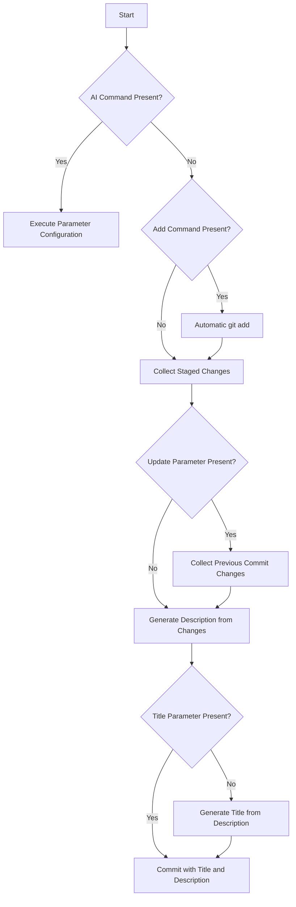

# Git Intelligence Message (GIM) 🚀

[](https://crates.io/crates/git-intelligence-message)
[](https://opensource.org/licenses/MIT)
[](https://github.com/yourusername/git-intelligence-message/actions/workflows/ci.yml)

An advanced Git commit message generation utility designed to automatically craft high-quality commit messages with precision and sophistication.

## Features

- 🤖 AI-powered commit message generation
- ⚡ Lightning fast Rust implementation
- 🔧 Easy configuration for various AI providers
- 🌍 Multi-language support
- 🔄 Automatic git staging (optional)
- ✏️ Amend previous commits

## Installation

### Using Homebrew (macOS/Linux)

```bash
brew tap yourusername/tap
brew install git-intelligence-message
```

### Using Cargo

```bash
cargo install git-intelligence-message
```

### Build from source

```bash
git clone https://github.com/yourusername/git-intelligence-message.git
cd git-intelligence-message
cargo install --path .
```

## Command Line Interface

### Basic Usage

```bash
# Generate commit message automatically
gim

# Specify commit title
gim --title "your commit title"

# Stage unstaged changes automatically
gim --auto-add

# Amend the most recent commit
gim --update
```

### Recommended Usage

```bash
# Basic usage - generate commit message for staged changes
gim

# Auto-stage changes and generate commit message
gim -a

# Amend the most recent commit
gim -apv
```

### Command Options

- `-t, --title <STRING>`: Specify the commit message title
- `-a, --auto-add`: Automatically stage all modifications
- `-p, --update`: Amend the most recent commit

### AI Configuration

Utilise the `gim ai` command to configure AI-related parameters:

```bash
# Configure AI model
gim ai --model "your-model-name"

# Set API key
gim ai --apikey "your-api-key"

# Define API endpoint
gim ai --url "your-api-url"

# Set output language
gim ai --language "your-language"
```

> 注意：`--url` 参数仅支持 OpenAI 兼容的 API 地址（如 OpenAI 官方或兼容 OpenAI 协议的第三方服务端点），不支持非 OpenAI 格式的 API。

#### AI Configuration Options

- `-m, --model <STRING>`: Specify the AI model to be utilised
- `-k, --apikey <STRING>`: Configure the API key for AI service
- `-u, --url <STRING>`: Set the API endpoint for AI service
- `-l, --language <STRING>`: Define the language for generated commit messages
- `-v, --verbose`: Show verbose output including AI chat content

## Workflow

View the workflow diagram through https://mermaid.live/:
