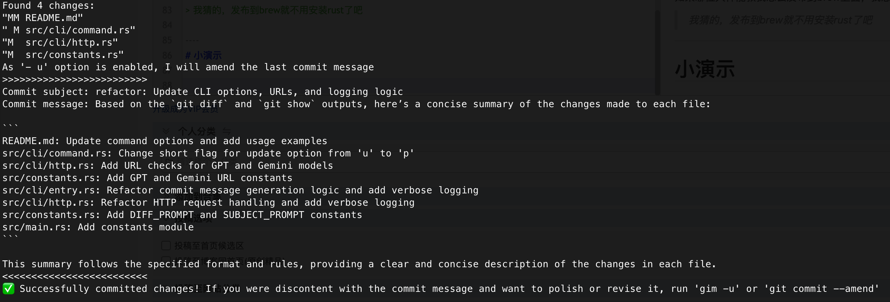

# Git Intelligence Message (GIM) 🚀

An advanced Git commit message generation utility designed to automatically craft high-quality commit messages with precision and sophistication.

## Features

- 🤖 AI-powered commit message generation
- ⚡ Lightning fast Rust implementation
- 🔧 Easy configuration for various AI providers
- 🔄 Automatic git staging (optional)
- ✏️ Amend previous commits

Ready for [Installation](installation)?